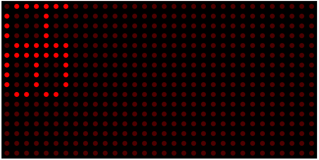
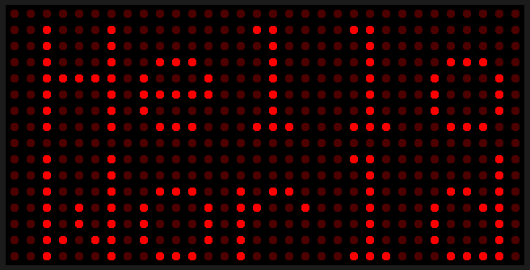

# DMDjs
A p5js implementation of the DMD library used for the Arduino platform. 

Function names and algorithm is a direct copy from the [Freetronics](https://www.freetronics.com.au/) team repo https://github.com/freetronics/DMD.

## Why tho?
ME: It came about to see if I can mimic a 32x16 monochrome LED matrix display within a browser. YOU: Well duh, of course you can ya dummy. YOU: But why p5js? ME:Well....oh look, that dog has a puffy tail!  

Anyhoo, I wanted to use ChatGPT because I cannot code my way out of a wet paper bag :grimacing:.

So, I started with `dot-matrix.html` to come up with a proof of concept using JavaScript embedded into HTML - all with the help of using ChatGPT. I ran into a problem where the characters will be displayed as they reside in memory. My attempts to have them rotated failed :confounded:.

Remembering that I have used a DMD Arduino library, I took the code an pumped it into ChatGPT to have it parse C++ to JavaScript. It wasn't a smooth process, and it did require me to put my thinking cap on now and then. But all-in-all, I was able to for the most part get the library to work 🥳.

## TODOs
 - [ ] Improve performance - *anymore than 1 panel, loading times increase*.
 - [ ] Move this to use Node.
 - [ ] Add support to split out the DMD class into it's own files.
 - [ ] Add support for more fonts, again, split out to it's own files.
 - [ ] Add support so you can add your own animations.
 - [ ] Add support to enter text to have it either static, scroll or other animations

## Known issues
KNOWN ISSUES:
1. As you add more displays, the slower the page loads by an order of magnitude; so, some optimization will need to be done.
2. As you add more displays down, either the `bDMDScreenRAM` gets corrupt and anomalies present themselves.